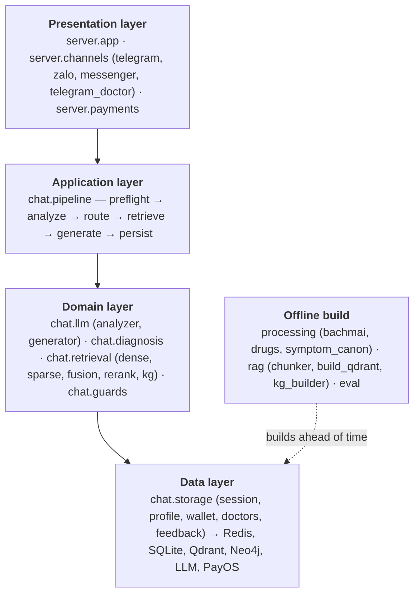
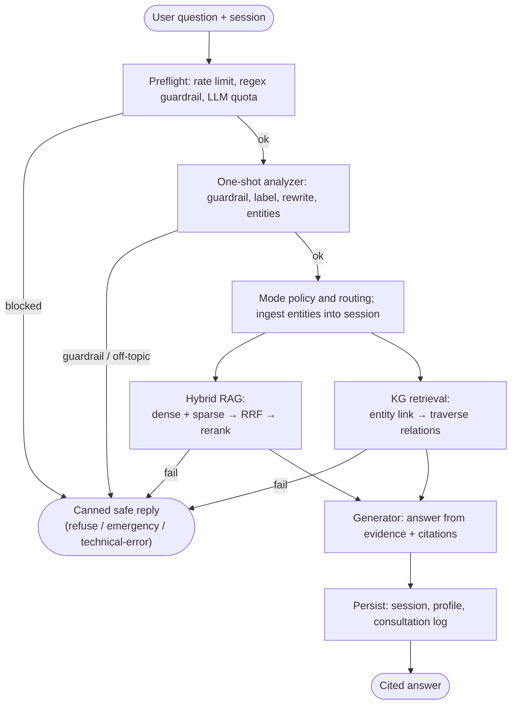
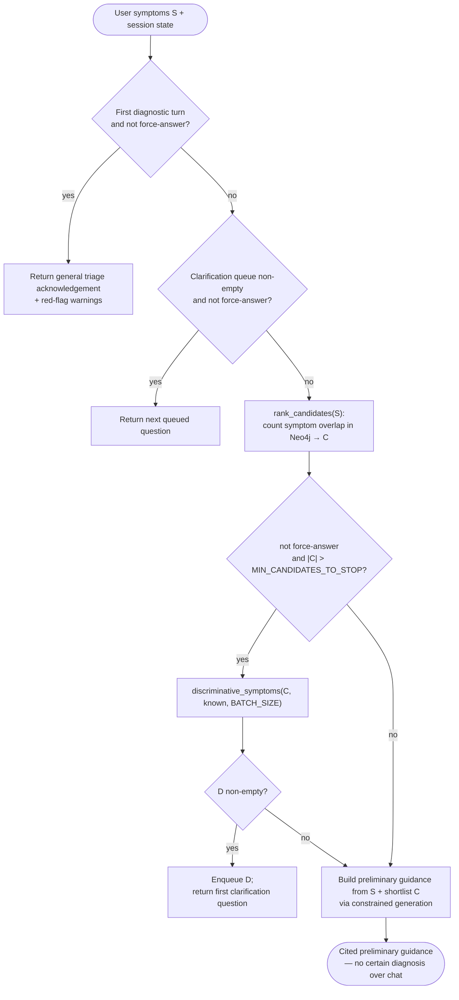
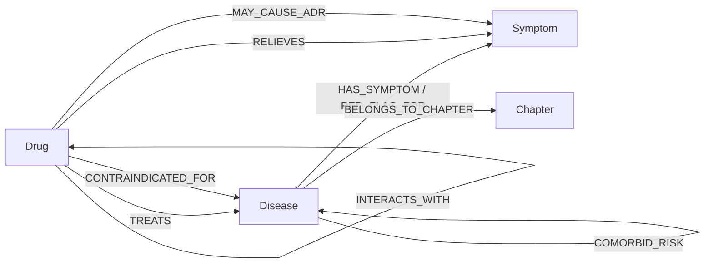
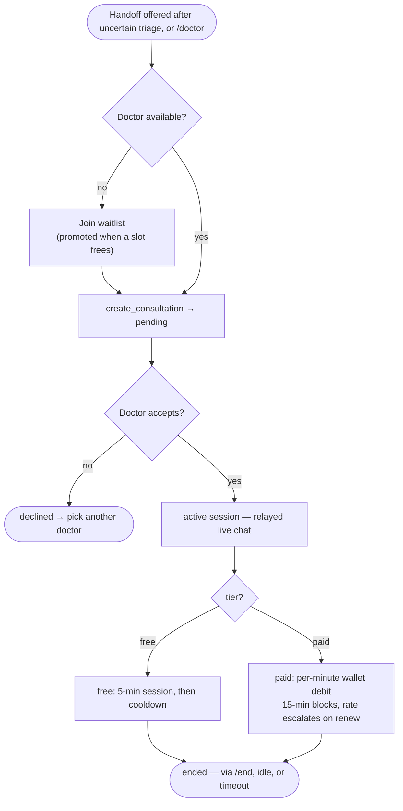
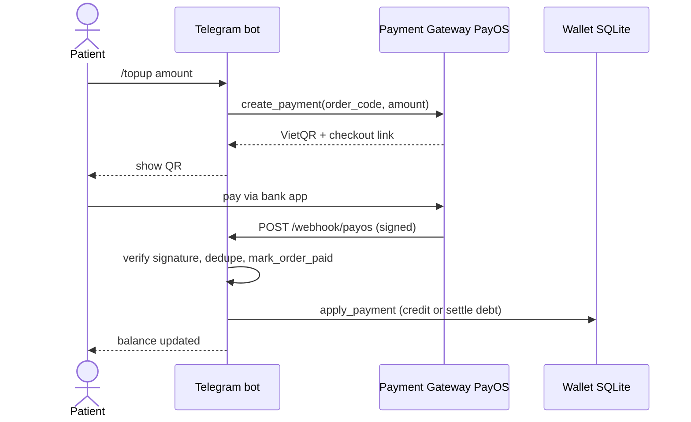

# Diagrams (Mermaid)

Mermaid versions of the report's TikZ figures (Chapter 4) plus code-derived
flows. Source-of-truth mapping:

| Mermaid below | Report figure |
|---|---|
| 1. Layered architecture | `fig:packages` |
| 2. Request pipeline (informational turn) | `fig:pipeline` |
| 3. Diagnostic narrowing | `alg:narrowing` |
| 4. Knowledge-graph schema | `fig:kg_schema` |
| 5. Doctor consultation lifecycle | code-derived (`doctors.py`, `telegram_doctor.py`) |
| 6. Top-up payment | code-derived (`payments/`, `wallet.py`) |

> Note: Mermaid has no native UML use-case notation, and `fig:kg_schema` is a
> relational graph, not a flowchart — rendered here as a labeled `flowchart`.
> Appendix A/B images (`IoT.png`, `Bia.PNG`) are template boilerplate, not project diagrams — excluded.

---

## 1. Layered architecture (`fig:packages`)

---

## 2. Request pipeline — informational turn (`fig:pipeline`)

Retrieval runs in parallel (two-worker pool); either source failing aborts the
turn with a safe technical-error reply (fail-closed). Guardrail/quota
short-circuits before any retrieval or generation.

---

## 3. Diagnostic narrowing (`alg:narrowing`)

---

## 4. Knowledge-graph schema (`fig:kg_schema`)

---

## 5. Doctor consultation lifecycle (code-derived)

From `doctors.py` (status `pending → active → ended/declined`, waitlist,
per-minute billing) and `telegram_doctor.py`.

---

## 6. Top-up payment (code-derived)

From `payments/payos.py`, `payments/router.py`, `wallet.py`.

